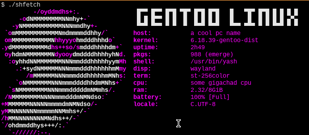

# ShiTTY FETCH (WIP)
this is a "simple" fetch for linux. single executable.
<h2>Dependencies:</h2>
A single posix compliant shell and linux OS.


<br>
<h2> OS support </h2>
<ul>
<li> Arch Linux </li>
<li> Gentoo </li>
<li> Alpine </li>
</ul>

im trying to make it as general as possible. so there
is a great chance that is going to work also on your
prefered `Linux` distribution with a troll icon.

<h3> compatible shells </h3>

✓ bash

✓ sash

✓ busybox ash

✓ yash

✓ ksh

× dash

× zsh

<h4> contributing </h4>
pushes are welcome as long as AI wasn't use in it in any way. I'm not impartial, I do not like LLMs. Sorry.

but if you don't know how to do it, if your OS is not listed. i can try to bring support for it.

send me, if possible, the output of

``` sh
$ cat /etc/os-release
```
and the name of your package manager (pacman, apt, xbps-install,...)

to mpwr@cock.li
